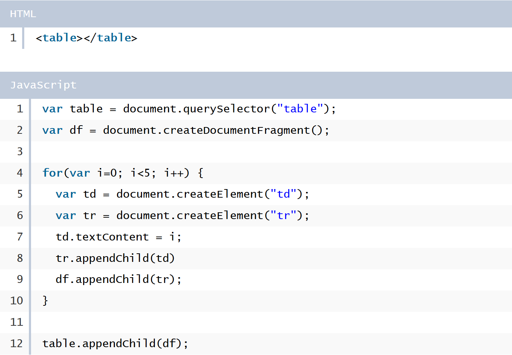

---
## 1. querySelector() & querySelectorAll()
---
~~~HTML

  
Paragraph 1

  
 cParagraph 2

  
Paragraph 3

~~~
~~~Javascript
var element1 = document.querySelector('#divId');
//returns the first element that matches the specified CSS selector: #divId.
var element2 = document.querySelectorAll('.pClass');
//returns all elements that matches with the specified CSS selector: .pClass as a NodeList object. 
//this object will be empty if no matching elements are found.
var element3 = document.querySelector(p);
// returns the first p element in the document. 
~~~

---
## 2. addEventListener()
---

This method adds an event listener to an element:
~~~javascript
var paragraph1 = document.querySelector(p);

paragraph1.addEventListener('click',baz);

function baz (){
    alert('You just clicked a paragraph 1');
}
~~~
This method also allows assignment of more than one function as event listeners to one event:

~~~javascript
var paragraph1 = document.querySelector(p);

paragraph1.addEventListener('click',baz);
paragraph1.addEventListener('click',foo);

function baz (){
    alert('This is the first event');
}
function foo (){
    alert('This is the second event');
}
~~~

- first parameter is the targeted event: 'click', 'mouseover', etc
- second parameter is a javascript function that will be triggered when event occurs
- third parameter is a set of boolean properties

Third parameter takes in three different options: `capture`, `once`, and `passive`.

1. `capture` :

    - when this option is set to `true`, the event handler is registered in the capturing phase.  
    `element.addEventListener('click', doSomething, true);`
    - when this option is et to false, the event handler is registered in the bubbling phase.  
        `element.addEventListener('click', doSomething, false);`

    - additional syntax to access this feature :  
    `element.addEventListener(evt,listener, {capture:true});`

2. `once` :
 
    - when set to true, the listener (the specified javascript function triggered on event) is called only for the first time.
    - the listener is automatically removed from the event. 
    - this is a hassle-free way of removing event handlers after its initial call.
    - syntax:     `element.addEventListener('click', doSomething, {once:true});`

3. `passive` :

    - when set to true, the event will not be cancelled by preventDefault()
    - this was introduced to improve smooth scrolling
    - some elements with preventDefault() slows down scrolling
    - syntax : `element.addEventListener('click', doSomething, {passive:true});`
    - [great video on passive event listeners](https://www.youtube.com/watch?v=DJYpXxWqvmo)

---
## 3. removeEventListener()
---

Removes an event listener from an element.

`element.removeEventListener(event, listener, [options]);`

Must specify the event, listener, and options.

Also, if the listener cannot be referenced, it will not be removed.

It will only remove a listener than is referenced.

For example :
~~~javascript

function foo(){
    alert('Foo!');
}

document.addEventListener('click',foo);
document.addEventListener('click',function() { alert('Hi'); });
document.removeEventListener('dblclick',foo);
// this will be removed
document.removeEventListener('dblclick', function() { alert('Hi'); });
// This cannot be removed.
~~~

---
## 4. createElement()
---

`document.createElement(tagName)`

`tagName` - the name of the HTML tag

~~~javascript
var newDiv = document.createElement(div);
~~~

---
## 5. appendChild()
---

This method adds an element as the last child of the element that this method is called on.

`element.appendChild(childElement);`

`element` - the HTML element which childElement will be added to  
`childElement` - the HTML added as the last child of `element`

---
## 6. removeChild()
---

Removes specified child element from the element that his method is called on.  

`element.removeChild(childElement)`

`element` - the HTML element which childElement will be added to  
`childElement` - the HTML element which will be removed from `element`

---
## 7. replaceChild()
---

Replaces a child element with another one

`element.replaceChild(newChild, oldChild);`

---
## 8. cloneNode()
---

Creates a copy of an existing element. 

An optional boolean value  is accepted to determine whether the element should be copied with all of its child elements.

This is set to be false by default, which clones only the node and its attributes.

`var copy = element.cloneNode([deep]);`

To set the optional boolean value to true, 
`var copy = element.cloneNode(true);`

---
## 9. insertBefore() & insertAfter()
---

Adds an element before/after another child element. 

`parentElement.insertBefore(newChild, refChild);`

`parentElement.insertAfter(newChild,refChild);`

---
## 10. createDocumentFragment()
---

Creates a `DocumentFragment` object, which is a DOM node that is not part of the DOM tree.

The layout change will not take effect before this document fragment object is passed into the DOM tree, using appendChild().

---
## 11. setAttribute()
---

Adds a new attribute or updates the value of an attribute to an HTML element.

`element.setAttribute(name, value);`

`name` - the name of the attribute
`value` - the value of the attribute

~~~javascript
var div = document.querySelector('div');
div.setAttribute('id','bigDiv');
~~~

---
## 12. getAttribute()
---

Returns the value of a specified attribute of an HTML element

`element.getAttribute(name);`

`name` - the name of the attribute of interest

---
## 13. removeAttribute()
---

Removes an existing attribute of an HTML element

`element.removeAttribute(name);`